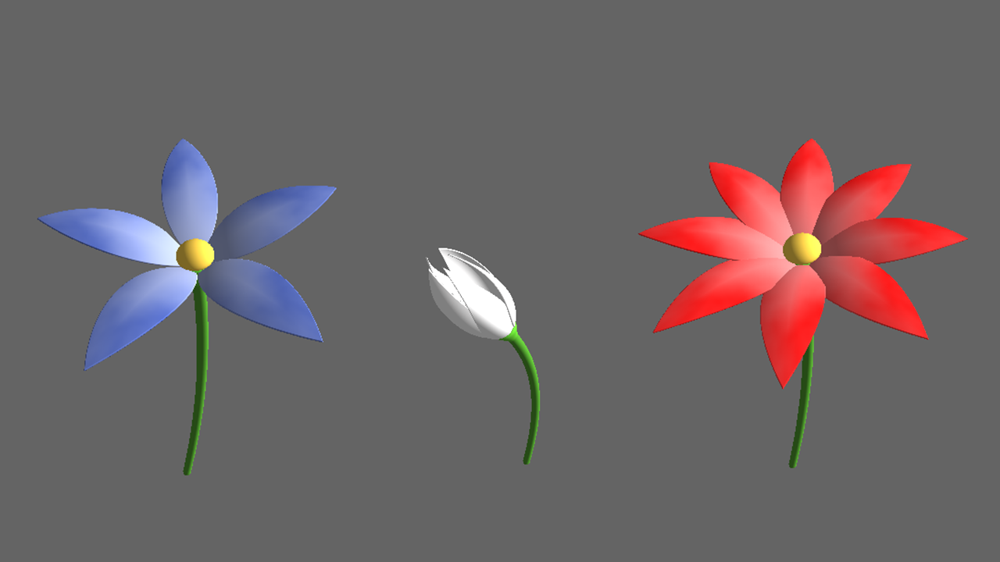
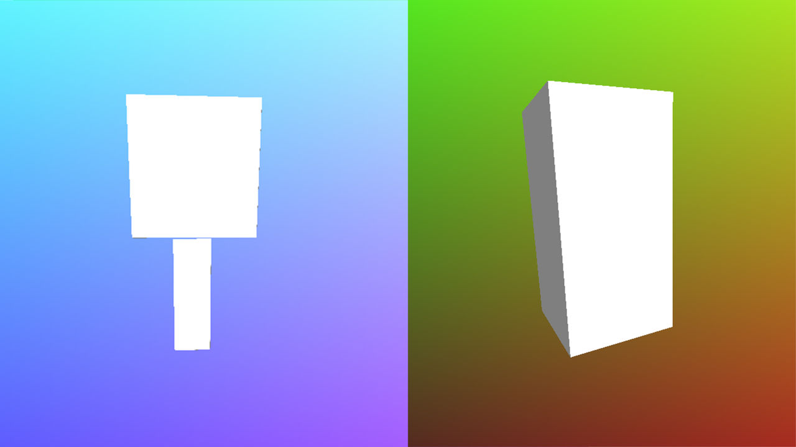

# Haoran Wei (82926501)

## Demo
[Demo Page](http://whaoran0718.github.io/hw02-raymarching-sdfs)

## Techniques
### Petal
Extrude from a 2D vesica. Bend every petal by using IQ's cheap bending function on x-axis, y-axis and z-axis respectively in local coord.
Rotate petals by time to simulate blossom and rotate the entire flower by inverse of rotation matrix. Use FBM-Perlin noise to generate texture of petal.

### Stem and Pistil
Union a round cone with a curved capsule which generated by extruding a 2D bezier curve and blend color by factor from IQ's smooth union function.
Substract a sphere by another big sphere to generate the base shape of Pistall.
Animation the stem by change key points of bezier curve and rotate flower accordingly.

### Animation
Use tiangle wave function to generate a periodic factor based on timer. Use gain and smoothstep function to generate a function which has a high changing rate in the middle
and smooth at end and beginning. Use the factor to drive the transformation animation and color animation of flower.

### Shading
Calculate normal vector base IQ's method and shade by Lambert diffusion model.

### BVH
Create bounding boxes for the entire flower and stem respectively based on their position and rotation.
Create a parent bounding box which generated from bounding boxes of flower and stem. The size of parent box changes wiht childern boxes.
Use ray-cube casting model to detect which objects is potential to be seen on the fragment.
Use a global bool array to reserve the casting information. If one cube can not be hit by the ray or won't be hit anymore, the flag of the cube will be false
which means this bounding box will not be checked by ray anymore.

## External Resources
- [IQ's Article on SDFs](http://www.iquilezles.org/www/articles/distfunctions/distfunctions.htm)